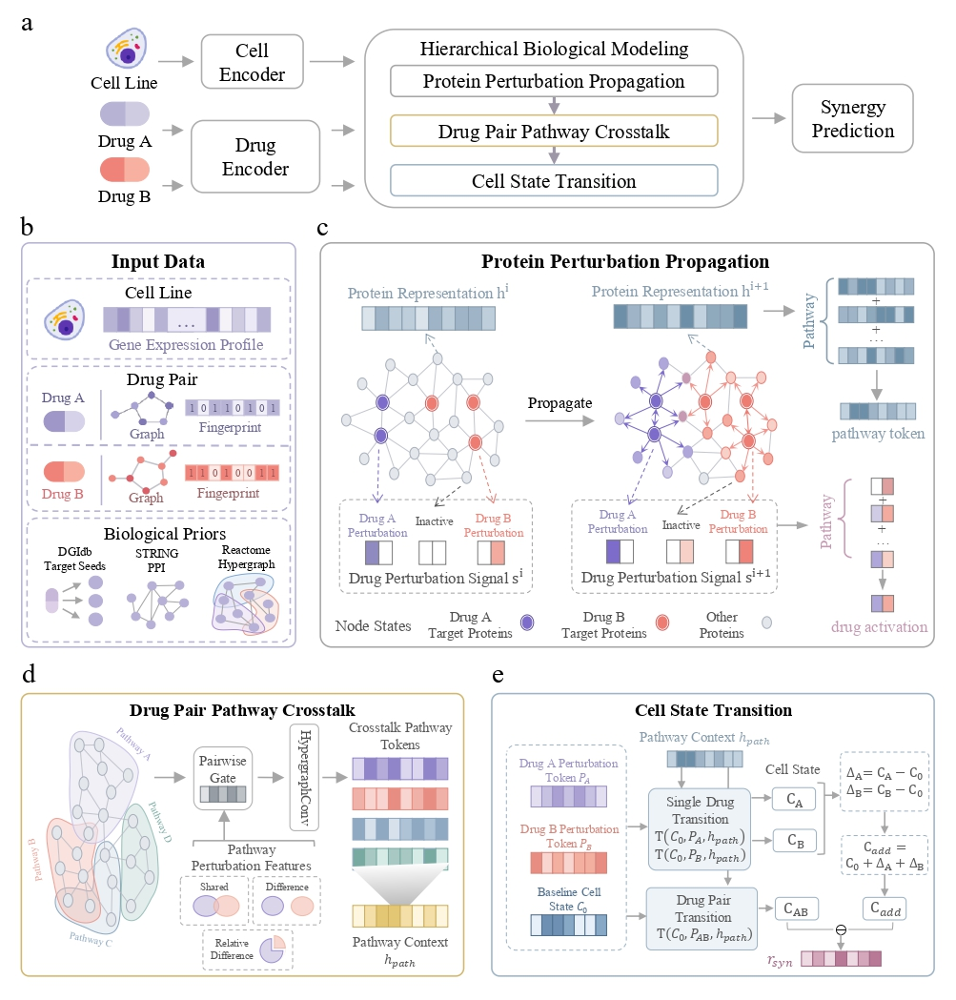

# PSTSyn
PSTSyn: a hierarchical biological modeling framework for drug synergy prediction by integrating protein perturbation propagation, drug-pair pathway crosstalk, and cellular state transition.
## Data availability

The datasets used in this study are available from the
[PSTSyn v1.0.0 release](https://github.com/l0921/PSTSyn/releases/tag/v1.0.0).

To download the data, open the release page and select the dataset
archive under **Assets**.

## Model architecture

